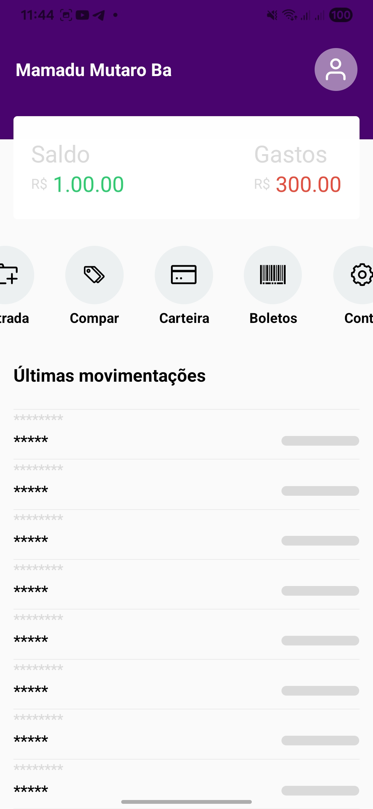
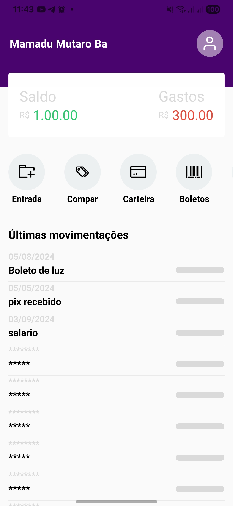

# Finança – Design de Aplicativo de Controle Financeiro

**Finança** é um projeto de design de aplicativo mobile, desenvolvido com foco em **UX/UI** para controle de finanças pessoais. Este projeto ainda está em fase de concepção, com telas, botões e animações planejadas para proporcionar uma experiência moderna e intuitiva.

## 🎨 Objetivos do Design
- Criar uma interface limpa e responsiva.
- Organizar informações financeiras de forma visual e clara.
- Explorar animações com Moti e Reanimated para transições suaves.
- Definir componentes reutilizáveis como Header, listas de movimentação e botões de ação.

## 📂 Estrutura Visual
- **Telas**: Home, Movimentações, Ações, Perfil do Usuário.
- **Componentes**: Botões, listas, cartões de informação, animações de entrada/saída.
- **Estilos**: Cores, espaçamentos e tipografia definidos para uma interface moderna.

## 🖼️ Protótipo

  
  

